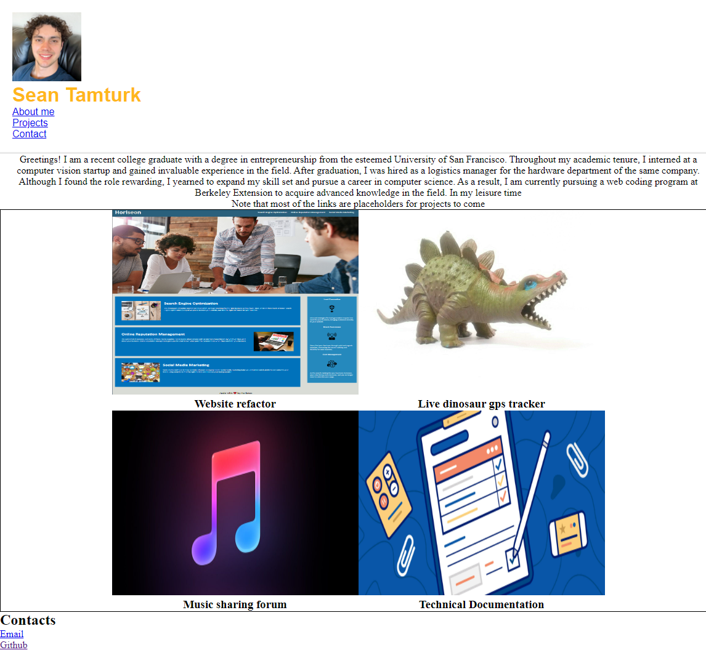

# Professional Portfolio ReadMe

## Description 

As a web developer, showcasing my skills and talents through a portfolio of work is essential. Not only does it highlight my best work, but it also demonstrates the thought processes behind it. Through my experience, I've found that having several deployed projects is crucial to landing an initial interview with many companies. That's why in this challenge, I'll be using my core skills in flexbox, media queries, and CSS variables to create a project that I can use in my job search. It's a win-win situation that will set me up for future success and help me practice my new skills.

## Acceptance Criteria

GIVEN I need to sample a potential employee's previous work
WHEN I load their portfolio
THEN I am presented with the developer's name, a recent photo or avatar, and links to sections about them, their work, and how to contact them
WHEN I click one of the links in the navigation
THEN the UI scrolls to the corresponding section
WHEN I click on the link to the section about their work
THEN the UI scrolls to a section with titled images of the developer's applications
WHEN I am presented with the developer's first application
THEN that application's image should be larger in size than the others
WHEN I click on the images of the applications
THEN I am taken to that deployed application
WHEN I resize the page or view the site on various screens and devices
THEN I am presented with a responsive layout that adapts to my viewport

## Technologies used
- Github
- Gitbash
- VS Code
- HTML and CSS

## License
MIT License

## Features
- Flexbox wrapping
- Site navigation links

## Links
- [Github](https://github.com/seantamturk/Professional-Portfolio)
- [Professional Portfolio](https://seantamturk.github.io/Professional-Portfolio/)
- [Linkedin](https://www.linkedin.com/in/sean-tamturk-8253b722a/)
- 

